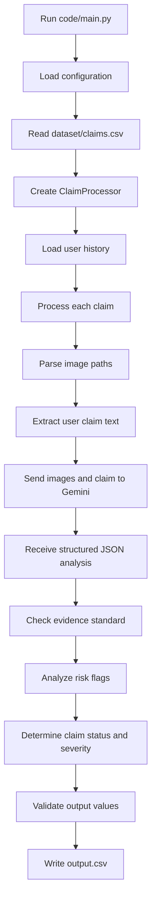

# Multi-Modal Evidence Review: Project Flow Report

## 1. Project Overview

This project is a Python-based multi-modal evidence review system built for the HackerRank Orchestrate challenge.

The system verifies damage claims using:

- claim conversation text
- submitted image evidence
- user claim history
- minimum evidence requirements

For every row in `dataset/claims.csv`, the system produces one structured row in `output.csv`.

The system supports three claim object types:

- `car`
- `laptop`
- `package`

The main goal is to decide whether the submitted images support, contradict, or do not provide enough information for the user's damage claim.

## 2. Repository Structure

```text
hackerrank-orchestrate-june26/
├── README.md
├── problem_statement.md
├── AGENTS.md
├── output.csv
├── code/
│   ├── main.py
│   ├── claim_processor.py
│   ├── config.py
│   ├── vision_analyzer.py
│   ├── evidence_requirements.py
│   ├── risk_analyzer.py
│   ├── prompts.py
│   ├── utils.py
│   ├── requirements.txt
│   └── evaluation/
│       ├── evaluate.py
│       └── evaluation_report.md
└── dataset/
    ├── claims.csv
    ├── sample_claims.csv
    ├── user_history.csv
    ├── evidence_requirements.csv
    ├── output.csv
    └── images/
        ├── sample/
        └── test/
```

## 3. Important Files

| File | Purpose |
|---|---|
| `README.md` | General challenge description and submission expectations |
| `problem_statement.md` | Full task specification, schema, allowed output values |
| `code/main.py` | Main runner for processing test claims |
| `code/config.py` | Central paths, model settings, allowed values, risk flags |
| `code/claim_processor.py` | Core claim processing pipeline |
| `code/vision_analyzer.py` | Gemini vision model integration |
| `code/prompts.py` | Prompt templates used for image analysis |
| `code/evidence_requirements.py` | Evidence standard checking logic |
| `code/risk_analyzer.py` | Risk flag and severity analysis |
| `code/utils.py` | CSV, path, logging, and text utility functions |
| `code/evaluation/evaluate.py` | Evaluation script for sample claims |
| `output.csv` | Final generated predictions for `dataset/claims.csv` |

## 4. Input Data

The project uses four main dataset files.

### 4.1 `dataset/claims.csv`

This is the main test input file.

It contains 44 claim rows.

Columns:

```text
user_id
image_paths
user_claim
claim_object
```

Each row represents one damage claim.

### 4.2 `dataset/sample_claims.csv`

This file contains 20 labeled sample claims.

It includes both input columns and expected output columns. It is used for local evaluation.

### 4.3 `dataset/user_history.csv`

This file contains 47 user history rows.

Columns include:

```text
user_id
past_claim_count
accept_claim
manual_review_claim
rejected_claim
last_90_days_claim_count
history_flags
history_summary
```

The system uses this data to add risk context, especially `user_history_risk`.

### 4.4 `dataset/evidence_requirements.csv`

This file contains evidence expectations by claim object and issue family.

It describes what kind of visual evidence is needed to evaluate different claim types.

## 5. Output Data

The generated output is written to:

```text
output.csv
```

Required output columns:

```text
user_id
image_paths
user_claim
claim_object
evidence_standard_met
evidence_standard_met_reason
risk_flags
issue_type
object_part
claim_status
claim_status_justification
supporting_image_ids
valid_image
severity
```

The current `output.csv` contains 44 rows, matching the number of rows in `dataset/claims.csv`.

## 6. High-Level Project Flow



## 7. Runtime Entry Point

The main command is:

```powershell
python code/main.py
```

The main file is:

```text
code/main.py
```

Its responsibilities are:

1. Create a `Config` object.
2. Read claims from `dataset/claims.csv`.
3. Create a `ClaimProcessor`.
4. Process each claim independently.
5. Catch failures and create fallback rows.
6. Write all final rows to `output.csv`.

If processing fails for a claim, the fallback output marks it as requiring manual review.

Fallback values include:

```text
evidence_standard_met = false
risk_flags = manual_review_required
claim_status = not_enough_information
valid_image = false
severity = unknown
```

## 8. Configuration Flow

Configuration is handled by:

```text
code/config.py
```

Important path settings:

```text
claims_path = dataset/claims.csv
sample_claims_path = dataset/sample_claims.csv
user_history_path = dataset/user_history.csv
evidence_reqs_path = dataset/evidence_requirements.csv
images_dir = dataset/
output_path = output.csv
```

Important model settings:

```text
vision_model = gemini-3.1-flash-lite-preview
temperature = 0.0
max_images_per_claim = 5
```

The implementation uses Gemini through the `google-genai` package.

Required environment variable:

```powershell
$env:GEMINI_API_KEY="your-key"
```

## 9. Claim Processing Flow

The main business logic is in:

```text
code/claim_processor.py
```

For each claim row, the system performs these steps:

1. Reads `user_id`, `image_paths`, `user_claim`, and `claim_object`.
2. Converts semicolon-separated image paths into local file paths.
3. Looks up user history from `user_history.csv`.
4. Extracts only user-side claim text from the conversation.
5. Sends the claim and images to the vision analyzer.
6. Extracts claimed issue type and object part using keyword rules.
7. Reads model output for issue type, object part, support status, and supporting images.
8. Applies evidence standard rules.
9. Determines final claim status.
10. Applies risk flags and severity logic.
11. Performs final schema validation.
12. Returns one output row.

## 10. Image and Vision Analysis Flow

Vision analysis is handled by:

```text
code/vision_analyzer.py
```

The system uses a `GeminiVisionClient`.

Flow:

1. Read the Gemini API key.
2. Build a prompt using `code/prompts.py`.
3. Attach up to 5 images for the claim.
4. Send the prompt and images to Gemini.
5. Request JSON output.
6. Retry on rate-limit errors.
7. Parse the response.
8. Normalize missing or invalid fields.

Expected model response structure:

```json
{
  "image_assessments": [
    {
      "image_id": "img_1",
      "is_clear": true,
      "is_cropped": false,
      "lighting_adequate": true,
      "angle_sufficient": true,
      "issues_visible": ["dent"],
      "affected_parts": ["front_bumper"],
      "damage_description": "Small dent visible."
    }
  ],
  "overall_issue_type": "dent",
  "overall_object_part": "front_bumper",
  "claim_supported": true,
  "supporting_image_ids": ["img_1"],
  "contradiction_reason": null,
  "severity": "low",
  "confidence": 0.9,
  "notes": ""
}
```

## 11. Prompt Flow

Prompt templates are stored in:

```text
code/prompts.py
```

The prompt tells the model to:

- inspect visible damage
- use only allowed issue types
- use only allowed object parts
- return strict JSON
- decide whether the claim is broadly supported

The prompt is intentionally permissive about support:

- if the user claims a scratch but the image shows a dent in the same area, the claim can still be considered supported
- contradiction should be used only when the claimed area is undamaged or the damage is on a different part

## 12. Evidence Standard Flow

Evidence checking is handled by:

```text
code/evidence_requirements.py
```

The intended flow is:

1. Load evidence requirements.
2. Match by claim object and issue type.
3. Determine the minimum evidence required.
4. Compare required evidence against supporting image count.

Important issue found:

The code expects `minimum_image_evidence` to be an integer, but the dataset contains text descriptions.

Example from `dataset/evidence_requirements.csv`:

```text
The claimed car panel or bumper should be visible from an angle where surface marks or deformation can be assessed.
```

Because of this, the parser often converts the value to `0`, which may cause the system to mark evidence standards as met too easily.

## 13. Risk Analysis Flow

Risk analysis is handled by:

```text
code/risk_analyzer.py
```

Risk flags come from three main sources.

### Image Quality

Possible flags:

```text
blurry_image
cropped_or_obstructed
low_light_or_glare
wrong_angle
```

### Claim and Evidence Mismatch

Possible flags:

```text
claim_mismatch
damage_not_visible
possible_manipulation
non_original_image
text_instruction_present
manual_review_required
```

### User History

Possible flag:

```text
user_history_risk
```

This is added when:

- history flags are not `none`
- last 90 days claim count is greater than 3
- rejected claim count is greater than 2

If there are multiple risks, the system may also add:

```text
manual_review_required
```

## 14. Severity Flow

Severity is determined mostly from issue type.

Severity mapping:

| Issue Type | Severity |
|---|---|
| dent | low |
| scratch | low |
| crack | medium |
| glass_shatter | high |
| broken_part | medium |
| missing_part | medium |
| torn_packaging | low |
| crushed_packaging | medium |
| water_damage | high |
| stain | low |
| none | none |
| unknown | unknown |

`claim_processor.py` also applies a boost if the user claim contains words such as:

```text
severe
extensive
large
deep
bad
heavy
major
significant
shatter
smashed
```

## 15. Claim Status Flow

The final claim status can be:

```text
supported
contradicted
not_enough_information
```

The logic is:

- If the model says the claim is contradicted and provides a contradiction reason, status becomes `contradicted`.
- If the model says the claim is supported and there are supporting images, status becomes `supported` only if evidence standard is met.
- If there are no supporting images, status becomes `not_enough_information`.
- If the system cannot decide, status defaults to `not_enough_information`.

## 16. Output Validation Flow

Before writing output, the system validates:

- `issue_type`
- `object_part`
- `claim_status`
- `severity`
- `risk_flags`

Invalid values are replaced with safe defaults such as:

```text
unknown
not_enough_information
none
```

This helps ensure the output follows the challenge schema.

## 17. Evaluation Flow

Evaluation is run with:

```powershell
python code/evaluation/evaluate.py
```

Evaluation script:

```text
code/evaluation/evaluate.py
```

Evaluation process:

1. Read `dataset/sample_claims.csv`.
2. Process sample claims using the same `ClaimProcessor`.
3. Compare predicted values against expected values.
4. Generate summary metrics.
5. Write `code/evaluation/evaluation_report.md`.

Compared fields:

```text
evidence_standard_met
risk_flags
issue_type
object_part
claim_status
valid_image
severity
```

Current evaluation report:

```text
Total Claims: 10
Correct: 2
Accuracy: 20.00%
```

This indicates that the project runs, but the current strategy has low exact-match accuracy on the evaluated sample subset.

## 18. Current Generated Output

The current root `output.csv` contains 44 rows.

This matches the number of rows in `dataset/claims.csv`.

There is also a `dataset/output.csv`, but it contains only headers and no prediction rows.

The final prediction file for submission appears to be:

```text
output.csv
```

## 19. Notable Implementation Mismatches

### 19.1 Documentation Says OpenAI/Claude, Code Uses Gemini

`code/README.md` mentions GPT-4o, Claude, and `OPENAI_API_KEY`.

However, the actual implementation uses:

```text
google-genai
GEMINI_API_KEY
gemini-3.1-flash-lite-preview
```

The documentation should be updated to avoid setup confusion.

### 19.2 Evidence Requirements Are Text, Code Expects Numbers

The evidence requirement parser expects integer minimum image counts.

The dataset provides text descriptions instead.

This can make evidence checks unreliable.

### 19.3 Evaluation Report Cost Assumes GPT-4o

The evaluation report estimates GPT-4o costs, but the actual model client uses Gemini.

The operational analysis should be updated to reflect Gemini usage.

### 19.4 Missing Evaluation Entry Point

Git status shows:

```text
D code/evaluation/main.py
```

The actual available evaluation script is:

```text
code/evaluation/evaluate.py
```

If the evaluator expects `code/evaluation/main.py`, this could cause an issue.

### 19.5 Low Evaluation Accuracy

The existing evaluation report shows only:

```text
20.00% accuracy
```

This suggests the current system is functional but needs improvement for better matching expected outputs.

## 20. Strengths

- Clear modular architecture.
- Main processing flow is easy to follow.
- Uses structured JSON from the vision model.
- Has fallback rows for processing failures.
- Validates output schema before writing.
- Includes risk analysis and user history integration.
- Has an evaluation workflow.
- Produces a complete `output.csv` for all test claims.

## 21. Weaknesses

- Evidence requirement logic does not match the actual CSV format.
- Documentation is partially stale.
- Evaluation report references a different model provider.
- Evaluation accuracy is currently low.
- Model dependency requires `GEMINI_API_KEY`.
- `code/evaluation/main.py` is missing despite being part of the starter contract.
- Some output values may be affected by aggressive post-processing rules.

## 22. Overall Flow Summary

The project follows this complete pipeline:

```text
dataset/claims.csv
        ↓
code/main.py
        ↓
ClaimProcessor
        ↓
parse image paths + extract user claim
        ↓
Gemini vision analysis
        ↓
evidence requirement check
        ↓
risk flag analysis
        ↓
claim status and severity decision
        ↓
schema validation
        ↓
output.csv
```

In short, this is a working evidence-review pipeline with a clear architecture. The most important improvements would be fixing evidence requirement parsing, updating documentation to match Gemini, restoring or redirecting the expected evaluation entry point, and improving the decision rules to raise sample-set accuracy.
